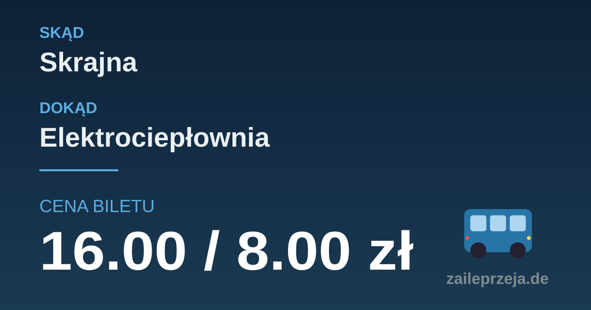
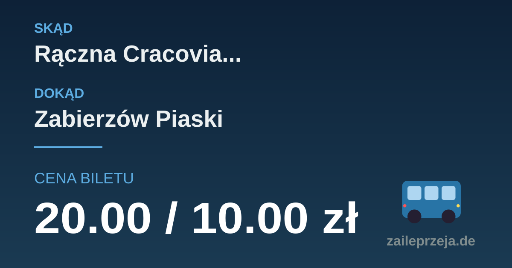

<p align="center">
  
</p>

<h1 align="center">🚌🚊 Za Ile Przejadę?</h1>

<p align="center">
  <a href="https://img.shields.io/badge/wersja-1.4.5-2A5BD5"></a>
  <a href="https://zaileprzeja.de"></a>
  <a href="https://github.com/wertos97/ZaIlePrzejade/commits/main"></a>
</p>

<p align="center">
  <a href="https://zaileprzeja.de"><strong>🌐 zaileprzeja.de</strong></a>
</p>

Kalkulator cen biletów KMK Kraków w systemie taryfy 2027 (płatność za
dystans). Użytkownik wybiera dwie grupy przystanków i dostaje **dwie trasy
o dowodziono optymalnej cenie**:

- **Tania trasa** — minimalna taryfa (każdy przejazd to osobny bilet liczony
  od zera, więc najtańsza trasa nie musi być najkrótsza),
- **Wygodna trasa** — minimum `taryfa + 2,00 zł za wsiadanie` (mało
  przesiadek bez ignorowania drogich objazdów).

Brak wyników przybliżonych: algorytm dowodzi optymalności albo jawnie
zgłasza przekroczenie limitu czasu.

## Podgląd

| Typowa cena | Cena na limicie dziennym |
|---|---|
|  |  |

Karty OG generowane przez `/api/og-image` — ta sama skala czcionki ceny
i przypięta prawa krawędź niezależnie od długości kwoty.

## Jak działa wyszukiwanie tras

Całość opiera się na grafie linii zbudowanym z danych GTFS
(`process_gtfs.py` → `processed/`): przystanki z pozycjami, krawędzie
linii z realnymi dystansami (`shape_dist_traveled`), przejścia piesze
między peronami.

1. **Sweep po linii** — Dijkstra po krawędziach jednej linii (plus darmowe
   przejścia między peronami tego samego klastra) wyznacza za jednym razem
   całą jazdę daną linią do wszystkich przystanków. **Bilet obejmuje
   przejazdy i przesiadkowe spacerki** — spacer nie zamyka biletu, jeśli
   wracamy na tę samą linię.
2. **Enumeracja przejazdów** — trasa to kompozycja całych przejazdów:
   jazdy 1 od startu (F1), jazdy 2 z miejsc przesiadek (F2) oraz jazdy
   wstecz od celu (B1/B2). Złożenia pokrywają **wszystkie trasy do 4
   przejazdów** i są odcinane progiem kosztu, więc typowa para liczy się
   w ułamkach sekundy.
3. **Certyfikacja** — 5. wsiadanie kosztuje co najmniej taryfę bazową
   (+ karę), a cena jest capowana limitem dziennym: najlepsza trasa
   ≤4-przejazdowa jest więc **dowodowo globalnym optimum**.
4. **A\* z pogłębianiem** — awaryjnie dla par niepokrytych enumeracją:
   Pareto A\* na `(koszt, kilometraż, wsiadania)` z limitami czasu
   (8 s / 8 s / 10 s przy limicie żądania 30 s). Timeout = brak wyniku
   dla trybu, nigdy wynik przybliżony.

Dwa tryby różnią się wyłącznie funkcją celu: **tania** minimalizuje samą
taryfę, **wygodna** taryfę powiększoną o karę za każde wsiadanie.

## Cache

Wyniki trafiają do **dwóch warstw** i żyją, dopóki nie zmienią się dane
GTFS (wersja feedu i algorytmu są w nazwie pliku bazy):

- **sqlite** (`processed/route_cache_<feed>_<algo>.sqlite`, WAL) —
  zapis przez write-through przy każdym wyliczeniu; przetrwa restart
  i wymiatanie z pamięci,
- **RAM** (25 MB) — gorący zestaw; po chybieniu wynik wraca z sqlite
  w 1–4 ms.

## Model cen (2027)

| Parametr | Wartość |
|----------|---------|
| Bilet bazowy (do 3,5 km) | 4,00 zł / 2,00 zł (ulgowy) |
| Każde kolejne 0,5 km | +0,50 zł / +0,25 zł |
| Maksymalna cena pojedynczego biletu | 9,00 zł / 4,50 zł |
| **Limit dzienny** | **20,00 zł / 10,00 zł** |

Konfiguracja: [`pricing.json`](pricing.json).

## Uruchomienie

Wymagania: Python 3.8+, zero zależności.

```bash
git clone https://github.com/wertos97/ZaIlePrzejade.git
cd ZaIlePrzejade
python server.py                # http://localhost:8080
```

Dane GTFS przetwarza `process_gtfs.py` (surowe zipy w `data/` →
`processed/*.json`).

## API

| Endpoint | Opis |
|----------|------|
| `GET /api/find-route?from=<id>&to=<id>` | `{convenient, cheap}` — obie trasy |
| `GET /api/stops` / `api/stops/search?q=` | Przystanki / wyszukiwanie |
| `GET /api/cost?distance=<km>` | Koszt dla dystansu |
| `GET /api/og-image?from=<id>&to=<id>&mode=` | Karta OG (SVG) |
| `GET /api/health` · `api/status` · `api/version` | Kondycja serwera |

## Testy

```bash
python -m unittest discover -s tests     # 75 testów
```

W tym `TestExactSearchExactness` — weryfikacja enumeracji wobec
brute-force oracle'a na grafie syntetycznym.

## Więcej

Szczegóły operacyjne (cache, wydajność, deploy, historia zmian):
[`PROJECT_INFO.md`](PROJECT_INFO.md).
